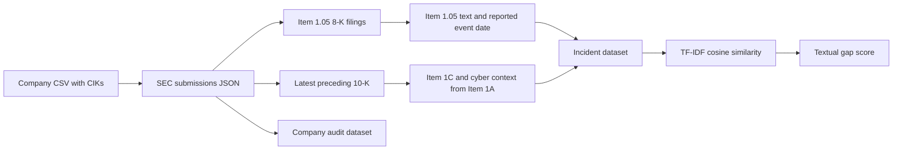

# SEC Cybersecurity Disclosure Pipeline

This repository collects US public companies' material cybersecurity incident disclosures, links each Item 1.05 Form 8-K to the latest preceding Form 10-K, and measures the textual gap between the pre-event risk disclosure and the post-event incident disclosure.

## What is complete

- A Microsoft proof of concept has been collected and scored. The original files and a fresh end-to-end validation are preserved in [`examples/msft`](examples/msft).
- The collector supports either one company or a CSV company universe.
- It finds every Item 1.05 filing after a chosen cutoff, rather than silently keeping only the first event.
- It records a company-level audit file, so a valid zero-result company is distinguishable from a request or parsing error.
- Batch output can be resumed without duplicating a CIK/accession pair.
- The NLP script scores every usable row with TF-IDF cosine similarity and `Textual_Gap = 1 - Cosine_Similarity`.

The repository does **not** contain a completed population dataset. Earlier local batch files contained headers but no observations, so they are excluded. The pipeline now exposes the reason for each zero or failure in `company_audit.csv`.

## Research flow



## Repository contents

| Path | Purpose |
| --- | --- |
| `sec_poc.py` | SEC collection, extraction, batch audit, and resume logic |
| `nlp_similarity.py` | Text preprocessing and textual-gap scoring |
| `data/sample_companies.csv` | Minimal input-schema example |
| `examples/msft/` | Original Microsoft proof of concept plus current two-filing validation |
| `tests/` | Offline tests for selection, extraction, deduplication, and scoring |
| `outputs/` | Default local output directory; generated files are ignored by Git |

## Setup

Python 3.10 or newer is recommended.

```bash
python -m venv .venv
source .venv/bin/activate
pip install -r requirements.txt
```

SEC requests must identify the researcher. Set a descriptive user agent containing your name or project and a monitored email address:

```bash
export SEC_USER_AGENT="Research Project your-email@example.com"
```

## Validate one company

```bash
python sec_poc.py single \
  --cik 789019 \
  --ticker MSFT \
  --company "Microsoft Corporation"
```

The default outputs are:

- `outputs/incidents.csv`: one row per Item 1.05 filing;
- `outputs/company_audit.csv`: one row per attempted company.

`8K_Reported_Event_Date` is the filing cover-page “date of earliest event reported.” It should not automatically be interpreted as the date the breach began or was discovered.

## Run a batch

The input must contain a `cik` column. The loader also recognizes `tic`/`ticker`, `conm`/`company`, and Compustat-style `timeLinkEnd_d`. It removes duplicate CIKs and, by default, excludes links that ended before the cutoff.

```bash
python sec_poc.py batch \
  --input /path/to/CIK.csv \
  --cutoff 2023-12-18 \
  --limit 100 \
  --resume
```

`--skip` and `--limit` are applied after filtering and CIK deduplication. Use `--include-inactive` only when the research design calls for historical links. A proprietary company universe such as Compustat/CRSP is intentionally not included in this public repository.

## Score the disclosures

```bash
python nlp_similarity.py \
  --input outputs/incidents.csv \
  --output outputs/incidents_scored.csv
```

Rows without both pre-event and incident text receive missing scores. A higher textual gap means lower lexical similarity; it is a descriptive measure and does not by itself establish that a company used boilerplate language or provided inadequate disclosure.

## Validation and limitations

Run the offline checks with:

```bash
python -m unittest discover -s tests -v
```

SEC filings vary in HTML and iXBRL structure. The extractor therefore records section-level status flags, but large research runs should still sample and manually validate extracted text. The public submissions endpoint can include supplemental history files, which the collector loads when they overlap the cutoff. The client retries temporary failures and keeps requests below the SEC's published maximum rate.

The older local notebooks that queried a commercial SEC API for generic Form 10-Q/10-K risk factors are a separate experiment. They are not included because they do not implement this Item 1.05 pipeline and contained an API credential. The credential should be rotated if it is still active.

## Data source

- [SEC EDGAR application programming interfaces](https://www.sec.gov/search-filings/edgar-application-programming-interfaces)
- [SEC fair-access rate guidance](https://www.sec.gov/filergroup/announcements-old/new-rate-control-limits)

This project is for research and reproducibility. Users remain responsible for checking filing text and complying with SEC access guidance.
